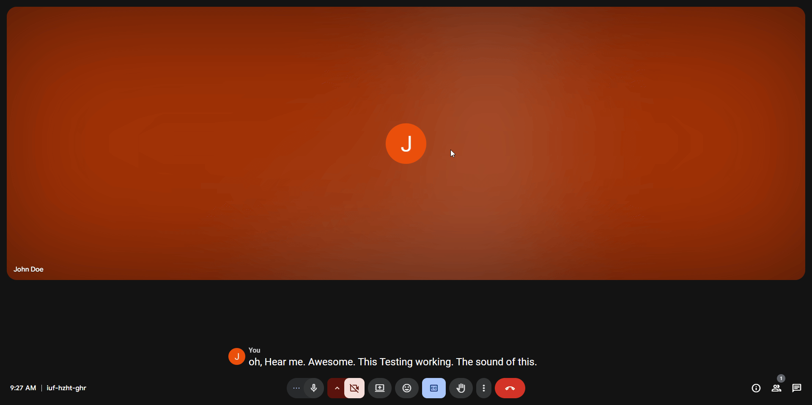

# 🎯 Google Meet Captions Downloader

A Chrome extension that allows you to download transcripts from Google Meet sessions as text files.

## 🚀 Features

- Download Google Meet captions in real-time
- Save transcripts as text files
- Easy-to-use popup interface
- Works with any Google Meet session

## 🛠️ Built With

- **React** - UI library for building the extension interface
- **Vite** - Next generation frontend tooling
- **TailwindCSS** - Utility-first CSS framework
- **TypeScript** - Static typing for JavaScript
- **Chrome Extension APIs** - For browser integration

> This project was bootstrapped with [vite-react-template](https://github.com/pleaobraga/vite-react-template)

## 💡 Usage



Follow these steps to use the extension:

1. Join any Google Meet session through your web browser
2. Click on the "Turn on captions" button (CC icon) in Google Meet to activate closed captions
3. When you want to save the transcription:
   - Click on the extension icon in your browser toolbar
   - Click the "Get Transcription" button in the popup
4. Choose where you want to save the transcription file when the download dialog appears
5. Open the downloaded file to view your meeting's transcription

> **Note:** Captions must be turned on in Google Meet for the extension to work properly.

## 📥 Installation

### For Development

1. Clone the repository:

```bash
git clone https://github.com/your-username/google-meet-captions-downloader.git
cd google-meet-captions-downloader
```

2. Install dependencies:

```bash
pnpm install
```

3. Build the extension:

```bash
pnpm build
```

### Loading the Extension in Chrome

1. Open Chrome and navigate to `chrome://extensions/`
2. Enable "Developer mode" in the top right corner
3. Click "Load unpacked"
4. Select the `dist` folder from your project directory

## 🔄 Updating the Extension

When making changes to the extension:

1. Make your code changes
2. Run the build command:

```bash
pnpm build
```

3. Go to `chrome://extensions/`
4. Click the refresh icon on your extension's card

## 💡 Usage

1. Join a Google Meet session
2. Click the extension icon in your browser toolbar
3. When captions are available, click "Download Transcript"
4. The transcript will be saved to your downloads folder

## 👤 Author

**[pleaobraga](https://github.com/pleaobraga)**

---

> **Note:** This extension requires permission to access Google Meet tabs and download files. All processing is done locally in your browser.
